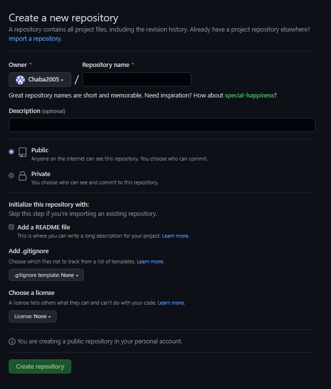

# Conceitos básico de Git e Github

## Qual a diferença entre Git e Github?

Conforme foi dito na "Introdução a Git", o Git é uma **ferramenta de versionamento**, ou seja, o Git é a ferramente em si, já o Github é uma plataforma que utiliza o git e é feito e armazenado o versionamento dos arquivos.

## Qual a lógica por trás?

Com a finalidade de facilitar a vida do programador e manter um controle sobre as mudanças e atualizações dos projeto é criado o Git. Através disso utiliza-se os conceitos de **repositório** e **branch**

###Sobre o repositório

O repositório nada mais é do que um diretório onde são armazenados arquivos. Nesse repositório é feito o controle do versionamento. Após fazer o cadastro de sua conta no site do Github você poderá criar seu primeiro repositório, basta clicar em **New** no canto esquerdo. Em seguida, aparecerá uma tela semelhante a essa.

Uma observação importante a fazer é sobre a questão do **Public** e **Private**, a grande diferença entre os dois seria no acesso ao repositório. Caso você escolha deixar o repositório público, todo mundo poderá clonar seu repositório e vizualizar seu código, porém, ninguém além de quem você permitir poderá de fato fazer uma mudança em seu código. Já se você escolher deixar privado será necessário criar um tolken de acesso para fazer alterações em seu respositório, e apenas quem você permitir poderá vizulizar seu repositório.

> *O mais comum é deixar o repositório público, por mais que todo mundo consiga vizualizar seu código isso em si não é o problema, o problema seria caso conseguissem alterar seu código, mas isso não é possível. Então, para os fins do curso, não vejo em si a necessidade de criar um repositório privado, pois muitas vezes o esforço do tolken de acesso pode acabar sendo chato.*

A opção de adicionar um arquivo `README` é opcional, quem desejar poderá estar adicionando um `README` para seu repositório onde ele será como um guia e conterá as informações importantes e um registro para seu repositório. Para fins de organização muitas vezes é interessante adicionar um `README`, mas não é fundamentalmente necessário.

> *O `README` é um arquivo que utliza **markdown**, uma linguagem de marcação de texto, não é complexo nem difícil, mas você terá que pesquisar um pouco sobre.*

O `.gitignore`, próprio nome sugere, é um arquivo de filtro, onde os elementos inclusos nesse filtro serão ignorados pelo Github e não será salvo esses tipos de arquivos. Então, caso você deseje incluir em seu repositório alguns arquivos que você não queira versionar basta incluir no `.gitignore`

Por fim, a parte sobre a licença pode ser ignorada. 

### Sobre branch

O conceito é tanto simples quanto um pouco complexo ao mesmo tempo. Tente imaginar o seu repositório como uma árvore, onde o ramo principal é chamado de `main` ou `master`, é na branch principal onde serão salvo os seus arquivos a princípio, porém o Github permite ao usuário criar outros ramos do repositório, quando é criado uma branch todos os arquivos da branch principal serão clonadas para a nova branch e todas as alterações feitas em uma branch não afetarão a outra. Esse é um recurso extremamente útil para se fazer testes, trabalhar com parceiros em um mesmo projeto e diversas outras coisas. Além disso, quando você pode também fundir novamente as branchs, por exemplo, você e seu parceiro de projeto fizeram partes diferentes e depois desejam unir tudo na branch principal novamente, isso é possivel. Entretanto, é importante ressaltar que pode ocorrer conflito de versões, onde a alteração feita por um pode acabar influcienciando na do outro, nesses casos o Github deixará com o usuário resolver os conflitos.

> *Ressaltamos que esse material é apenas um guia básico e para o caso de dúvidas e problemas basta nos contactar. No Google existem muitos sites informativos sobre Github, vale pesquisar também.*

